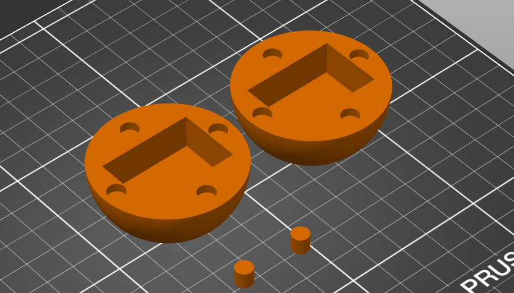

### Model Files

_A collection of model files are provided to help integrate the drop logger into hailstone models._

These parts consist of
- 50 mm diameter hemisphere to enclose the logger
- 3 mm diameter pins (6mm length) to  close the hemispheres

With two hemispheres, the cavity for the logger is: 33 mm long, 22 mm wide and 25 mm high

The hemispheres are held together using:
- 2x 3D printed pins that occupy two pairs of slots
- 2x pairs of 6mm wide x 3mm high neodymium magnets (cylinder shape) that use the remaining two pairs of slots.
- Epoxy glue is ideally used to secure magnets.

Parts are provided as a CAD file (.stl) for integration with hail models and 3D printing mesh files (.stl).

Integration into a hailstone model requires:
1. Selecting hailstone models which can fit a 50 mm diameter sphere
2. Marking the centre of mass (CoM) for the model
3. Remove a 50 mm sphere from the hailstone centred at the CoM.
3. Slicing the hailstone model on the Dmax-Dint axis, through the CoM
4. Inserting a droplogger hemisphere in each cavity.
5. Add pins and magnets to each hailstone half.

Test drops used tough PLA+ printed with 40% fill (and orientated so cavity and pin slots need no supports).

