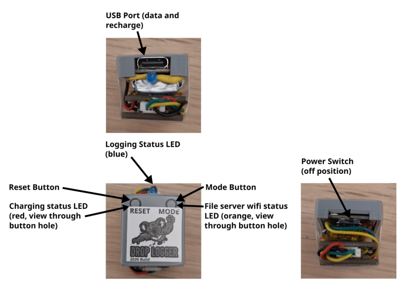

# Drop Logger — User Guide


## Table of Contents

- [Overview](#overview)
- [Power](#power)
- [Hardware Connections](#hardware-connections)
- [Sensor Specifications and Calibration](#sensor-specifications-and-calibration)
  - [BMP581 — Barometric Pressure](#bmp581--barometric-pressure)
  - [ICM20649 — Accelerometer and Gyroscope](#icm20649--accelerometer-and-gyroscope)
  - [Accelerometer Calibration](#accelerometer-calibration)
  - [Implications for Drop Experiments](#implications-for-drop-experiments)
- [Device Modes](#device-modes)
  - [Fall Detection](#fall-detection)
- [Data Logging](#data-logging)
  - [Starting a Log](#starting-a-log)
  - [Stopping a Log](#stopping-a-log)
  - [Output Files](#output-files)
  - [Binary File Format](#binary-file-format)
- [Downloading Data](#downloading-data)
  - [Option 1: WiFi File Server (Recommended)](#option-1-wifi-file-server-recommended)
  - [Option 2: USB (via serial tools)](#option-2-usb-via-serial-tools)
- [Converting Binary Files to CSV](#converting-binary-files-to-csv)
  - [CSV File Format](#csv-file-format)
- [Configuration](#configuration)
  - [Device Name](#device-name)
  - [Fall Detection Sensitivity](#fall-detection-sensitivity)
- [Code Overview — `drop_logger.py`](#code-overview--drop_loggerpy)
  - [Sensor Initialisation](#sensor-initialisation)
  - [The Logging Loop](#the-logging-loop)
  - [Key Variables You Might Want to Change](#key-variables-you-might-want-to-change)
- [File Structure Summary](#file-structure-summary)
---

## Overview

The Drop Logger is an ESP32-S3-based data logger designed to record barometric pressure, acceleration, and gyroscope data at high frequency (approx every 3 ms). It uses two sensors over I2C:

- **BMP581** — barometric pressure sensor (records pressure difference from a reference taken at startup)
- **ICM20649** — 6-axis accelerometer and gyroscope (records acceleration magnitude in m/s² and 3-axis rotation in °/s)

The device is designed to be mounted inside a 3D-printed hailstone and dropped from a drone at heights of 100+ m. The recorded data allows characterisation of tumbling motions and fall dynamics of non-spherical hailstones.

The device logging is controlled entirely with the **Mode/Boot button** (GPIO 0) and provides feedback through an **onboard blue LED** (GPIO 2).



---
## Power

The drop logger uses a permanently connected 3.7V 180mah lithium polymer battery. A fully charged battery will power the logger for at least 1 hour (e.g., 2-3 full flights).

To turn on the device, slide the switch towards the left side of the device (when viewing the logo from the front). The device will also be powered by usb regardless of the switch position.

To charge the battery, connect via usb when the power is switched on. A small red led will start flashing during charging and turn off when charging is completed. Charging takes approximately 1 hour to complete.

---

## Hardware Connections

| Component | ESP32-S3 Pin |
|-----------|-------------|
| I2C SCL | GPIO 6 |
| I2C SDA | GPIO 5 |
| BLUE LED | GPIO 2 |
| BOOT/MODE button | GPIO 0 |
| BMP581 address | 0x47 |
| ICM20649 address | 0x68 |

---

## Sensor Specifications and Calibration
  
### BMP581 — Barometric Pressure
 
The BMP581 is a 24-bit absolute barometric pressure sensor from Bosch Sensortec. It provides on-chip linearization and temperature compensation.
 
**Datasheet specifications:**
 
| Parameter | Value |
|-----------|-------|
| Pressure operating range | 300–1250 hPa |
| Absolute accuracy (typical) | ±0.3 hPa (~±2.5 m altitude) |
| Absolute accuracy (max) | ±0.5 hPa (~±4 m altitude) |
| Relative accuracy (900-1100hPa) | ±0.4 Pa (~±0.033 m altitude) |
| Pressure resolution | 1/64 Pa (0.015625 Pa) |
| RMS noise (typical) | 0.08 Pa at 1000 hPa |
| Temperature coefficient offset | ±0.5 Pa/K (typical) |
| Long-term drift | ±0.1 hPa over 12 months |
| Temperature accuracy | ±0.5 °C |
| Maximum output data rate | up to 240 Hz (OSR×1) |
 
**Logger configuration:** The logger uses the fastest possible settings — OSR×1 for both pressure and temperature, with the IIR filter disabled (`COEF_0`). This maximises sample rate at the cost of higher per-sample noise. The noise specifications above are typical values; at OSR×1 with no filtering, individual samples will be noisier than the best-case figures. Higher oversampling (e.g. OSR×128) reduces noise dramatically but slows the output data rate.
 
  
### ICM20649 — Accelerometer and Gyroscope
 
The ICM20649 is a wide-range 6-axis MEMS inertial measurement unit from TDK InvenSense, designed for high-impact and high-speed rotation applications. It features a 16-bit ADC for each axis.
 
**Datasheet specifications:**
 
| Parameter | Value |
|-----------|-------|
| Accelerometer full-scale ranges | ±4g, ±8g, ±16g, ±30g |
| Accelerometer sensitivity error | ±0.5% |
| Accelerometer noise density | 285 µg/√Hz |
| Gyroscope full-scale ranges | ±500, ±1000, ±2000, ±4000 °/s |
| Gyroscope sensitivity error | ±0.5% |
| Gyroscope noise density | 0.0175 °/s/√Hz |
| ADC resolution | 16-bit per axis |
| Operating temperature range | −40 to +85 °C |
 
**Logger configuration:** The accelerometer is set to ±8g and the gyroscope to ±4000 °/s. At the ±8g range, the raw sensitivity is 4096 LSB/g, giving a per-axis resolution of approximately 0.0024 m/s². At the ±4000 °/s gyroscope range, the sensitivity is 8.2 LSB/°/s, giving a resolution of approximately 0.12 °/s per axis. The ±8g accelerometer range is sufficient for freefall (~0g) through to aerodynamic deceleration, while the ±4000 °/s gyro range accommodates the fast tumbling expected during drop experiments.
 

### Accelerometer Calibration
 
The logger applies a simple scale correction to the acceleration magnitude to compensate for sensor bias. The correction factor is computed as:
 
```
accel_scale_correction = 9.80665 / a_mag_at_rest
```
 
where `a_mag_at_rest` is the measured acceleration magnitude when the sensor is stationary (currently set to 10.21 m/s² in `config/accel_calibration.txt`). The expected value at rest is 1g (9.80665 m/s²), so the correction factor (~0.960) scales all magnitude readings to compensate for the consistent offset. This is a first-order correction that assumes the bias is uniform across all axes and magnitudes. It does not correct for per-axis offset, cross-axis sensitivity, or nonlinearity.
 
**The value of `a_mag_at_rest` stored in `config/accel_calibration.txt` should be recalibrated for each individual sensor unit, as the offset varies from device to device.**
 
### Implications for Drop Experiments
 
For typical drop experiments from 100+ m, the key measurement considerations are:
 
**Pressure/altitude:** The relative accuracy of ±0.04 Pa (~±0.033 m) is more than adequate for tracking altitude changes of 100–250 m. However, the absolute accuracy of ±0.3 hPa (~±2.5 m) means the starting altitude cannot be determined to better than a few metres from pressure alone. The OSR×1 setting with no IIR filter means individual pressure samples will be noisy, but post-processing (e.g. a moving average) can smooth this out without affecting the overall altitude profile.
 
**Acceleration:** During freefall the sensor should read close to 0g (limited by aerodynamic drag on the hailstone). The ±8g range provides headroom for launch accelerations and impact events. The 0.01 m/s² recorded resolution is sufficient to distinguish freefall from rest.
 
**Gyroscope:** The ±4000 °/s range covers up to ~11 full rotations per second, which is expected to be sufficient for moderate tumbling. The 1 °/s integer resolution in the recorded data is adequate for characterising tumble rates and their evolution during the fall.

---

## Device Modes

On power-up the device enters a waiting state and continuously monitors the accelerometer. There are three ways to proceed:

| Trigger | Action | BLUE LED Feedback |
|---------|--------|-------------|
| **Fall detected** | Logging starts automatically | Blue LED on |
| **Short MODE button press** (<2 s) | Logging starts manually | Single flash, then Blue LED on |
| **Long MODE button press** (≥2 s) | WiFi file server starts | Blue LED blinks while held, then triple blink |

### Fall Detection

The device continuously reads the accelerometer and computes total acceleration magnitude (`√(aX² + aY² + aZ²)`). If this value drops below **5 m/s²** for **0.25 s**, the device assumes it is in freefall and starts logging automatically. This means you can power on the device before mounting it in the hailstone, and logging will begin on its own when dropped.

### Reset button

The reset button will restore the logger to the waiting state (but ideally do not use to terminate logging)

---

## Data Logging

### Duration

The total storage for data files is 5.8MB, which is approximately 24 minutes of data with the current binary encoding

### Starting a Log

Logging starts via any of the three triggers described above. Once running, the **Blue LED stays on** to indicate data is being recorded.

### Stopping a Log

Press the **MODE button** at any time to stop recording. The button is checked on every sample iteration:

1. **Press the MODE button** — recording stops immediately.
2. The **Blue LED turns off** and the serial console prints `Finished`.
3. The data file is flushed and closed.

Logging will also stop automatically if free storage drops below ~50 KB.
Frees space for storage is approximate 5.8 MB.

### Output Files

Data files are saved to the `/data/` directory on the ESP32's flash filesystem in binary format. Each run creates a new `.bin` file with an auto-incrementing number using the device name: `droplogger_1.bin`, `droplogger_2.bin`, etc. (or `{device_name}_1.bin` if you've changed the device name).

### Binary File Format

Each file uses the `DL01` binary format, consisting of a header followed by fixed-size data rows.

**Header (8 bytes):**

| Field | Type | Description |
|-------|------|-------------|
| Magic | 4 bytes | `DL01` — format identifier |
| Reference pressure | float32 | Absolute pressure in hPa at startup |

**Row (16 bytes each):**

| Field | Type | Unit | Description |
|-------|------|------|-------------|
| `time_ms` | uint32 | milliseconds | Elapsed time since logging started |
| `p_diff` | int32 | milli-hPa | `(ref_pressure − current_pressure) × 1000`. Positive values mean pressure has decreased (altitude increased). |
| `a_mag` | uint16 | centi-m/s² | Acceleration magnitude × 100 (`√(aX² + aY² + aZ²)`), with a scale correction applied |
| `gX` | int16 | °/s | Rotation rate around X axis (integer) |
| `gY` | int16 | °/s | Rotation rate around Y axis (integer) |
| `gZ` | int16 | °/s | Rotation rate around Z axis (integer) |

All values are big-endian. To reconstruct absolute pressure: `absolute_pressure = ref_pressure − (p_diff / 1000)`.

---

## Downloading Data

There are two ways to get data off the device: over WiFi using the built-in file server, or over USB.

### Option 1: WiFi File Server (Recommended, much much faster)

This is the easiest method and doesn't require any software on your computer beyond a web browser.
Make sure the PC/laptop is within 30 cm of the logger to get a good wifi signal (The logger has no wifi antenna...) 

1. **Power on** the device.
2. **Long-press the MODE button** (hold for ≥2 seconds). The Blue LED will blink while held and then triple-blink to confirm.
3. The device creates a **WiFi access point** named after the device (default: `droplogger`). The password is `hailstone`.
3. Orange LED under the MODE button will be activated.
4. **Connect your phone or laptop** to this WiFi network.
5. **Open a browser** and navigate to `http://192.168.4.1`.
6. You'll see a file listing page where you can **download** or **delete** individual files, or **delete all** files at once.

The device name (and therefore WiFi AP name) is read from `config/device_name.txt` on the ESP32's filesystem. See [Configuration](#configuration) for details.

### Option 2: USB (via serial tools, slow)

Connect to the ESP32-S3 over USB and use one of these tools:

- **Thonny IDE** — Connect to the board, navigate to `/data/` in the file browser, right-click a file and choose "Download to…".
- **mpremote** — `mpremote cp :/data/droplogger_1.bin .`
- **ampy** — `ampy --port /dev/ttyUSB0 get /data/droplogger_1.bin > droplogger_1.bin`

Replace the serial port (`/dev/ttyUSB0`, `COM3`, etc.) as appropriate for your system.

---

## Converting Binary Files to CSV

If you have `.bin` files from the logger (binary format, identified by the `DL01` magic header), you can convert them to CSV on your desktop computer using `unpack_droplogger_binary.py`. This is a standard Python script (not MicroPython) — run it on your PC. It does not require any non-standard Python libraries.

**Basic usage:**

```bash
python unpack_droplogger_binary.py droplogger_1.bin
```

This produces `droplogger_1.csv` alongside the original file.

**Specify output path:**

```bash
python unpack_droplogger_binary.py droplogger_1.bin -o output.csv
```

This produces `output.csv`.

**Batch convert a folder:**

```bash
python unpack_droplogger_binary.py /path/to/folder/
python unpack_droplogger_binary.py /path/to/folder/ --replace
```

This converts all .bin files in the directory.

### CSV File Format
 
Each output CSV contains a header row, a reference row, and then continuous data rows.
 
**Header:**
 
```
time(s),Pressure Difference(hPa),a(ms^-2),gX(deg/s),gY(deg/s),gZ(deg/s)
```
 
**Reference row:** The first data row has time set to `-0.001` and the second column contains the **absolute reference pressure** in hPa recorded at startup. The remaining columns are empty. This allows you to reconstruct absolute pressure from the differential values in subsequent rows: `absolute_pressure = ref_pressure − pressure_difference`.
 
**Data columns:**
 
| Column | Unit | Description |
|--------|------|-------------|
| `time(s)` | seconds | Elapsed time since logging started (millisecond resolution) |
| `Pressure Difference(hPa)` | hPa | `ref_pressure − current_pressure`. Positive values mean pressure has decreased (altitude increased). |
| `a(ms^-2)` | m/s² | Acceleration magnitude (`√(aX² + aY² + aZ²)`), with scale correction applied |
| `gX(deg/s)` | °/s | Rotation rate around X axis (integer) |
| `gY(deg/s)` | °/s | Rotation rate around Y axis (integer) |
| `gZ(deg/s)` | °/s | Rotation rate around Z axis (integer) |
 
**Example:**
 
```
time(s),Pressure Difference(hPa),a(ms^-2),gX(deg/s),gY(deg/s),gZ(deg/s)
-0.001,1008.234,,,,
0.003,0.012,9.81,0,-1,2
0.006,0.025,9.78,1,0,1
0.009,0.041,9.83,-1,2,0
```
---

## Configuration

### Device Name

The device name is read from a file called `config/device_name.txt` on the ESP32's filesystem. If the file doesn't exist or is empty, the default name `droplogger` is used. This name is used for both the WiFi access point SSID and the binary file naming.

To change the device name, create or edit `config/device_name.txt` on the ESP32 (e.g. via Thonny or mpremote):

```
my-hailstone-1
```

### Fall Detection Sensitivity

In `main.py`, these variables control the automatic fall trigger:

```python
fall_trigger_counter_limit = 5    # consecutive low-g readings required (note: 0.05s between readings)
fall_trigger_a_threshold = 5      # m/s² — readings below this count as freefall
```

Lowering the threshold or increasing the counter limit makes fall detection less sensitive (fewer false triggers). Raising the threshold or lowering the limit makes it more sensitive.

---

## Code Overview — `drop_logger.py`

This section walks through the main logging script for anyone wanting to modify it.

### Sensor Initialisation

The `main()` function sets up both sensors on a shared I2C bus:

- **ICM20649** is configured with a gyro range of ±4,000 °/s (`RANGE_4000_DPS`) to capture fast rotations without clipping.
- **BMP581** is configured for speed over precision: 1× oversampling on both pressure and temperature, no IIR filtering (`COEF_0`). This gives the fastest possible sample rate at the cost of some noise.

A "burn" read (`_ = bmp.pressure`) discards the first pressure measurement after power-on, which can be unreliable. The second read is saved as the reference pressure.

An accelerometer scale correction factor is applied to compensate for sensor bias: `accel_scale_correction = 9.80665 / a_mag_at_rest` where `a_mag_at_rest` is the measured magnitude when stationary and set in `config/accel_calibration` (default is `10.21 m/s²`).

### The Logging Loop

The core loop runs as fast as the I2C reads allow (no explicit delay):

1. **Read pressure** and compute the difference from the reference.
2. **Read acceleration** — 3-axis values are read and combined into a single magnitude (`√(aX² + aY² + aZ²)`), then scale-corrected.
3. **Read gyroscope** — 3-axis values in °/s (written as integers).
4. **Timestamp** using `utime.ticks_us()` for microsecond resolution (stored as milliseconds).
5. **Pack and write** a binary row to the open file.

The MODE button is checked on every iteration and will immediately stop recording if pressed. Every 500 rows the file buffer is flushed to flash storage and available disk space is checked.

---

## File Structure Summary

| File | Runs on | Role |
|------|---------|------|
| `main.py` | ESP32 | Entry point — fall detection, button handling, launches logger or file server |
| `drop_logger.py` | ESP32 | Core high-speed sensor logging to binary |
| `file_server.py` | ESP32 | WiFi access point and HTTP file server for downloading/deleting data |
| `bmpxxx.py` | ESP32 | MicroPython driver for BMP581/585/390/280/BME280 pressure sensors |
| `icm20649.py` | ESP32 | MicroPython driver for ICM20649 accelerometer/gyroscope |
| `i2c_helpers.py` | ESP32 | Low-level I2C register read/write utilities used by the BMP driver |
| `boot.py` | ESP32 | MicroPython boot file (default, mostly empty) |
| `unpack_droplogger_binary.py` | Desktop PC | Converts binary `.bin` log files to CSV |

This project was built with the assistance of Anthropic's Claude.
For questions or problems, please raise an issue in the github issue tracker.

